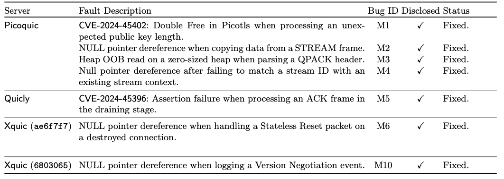

# QUIC-Fuzz
A QUIC-specific grey-box mutation-based fuzzer.

Our work is currently being prepared for submission. We will publish our work once it is accepted.

Thank you.

### Four bug (fixed) case studies found by QUIC-Fuzz
#### (M1) Double-free error in Picotls when processing an unexpected public key length.
When analysing the crashes found on the Picoquic server, we identified a bug causing the server to crash; this indicated a double-free error. This issue arises from the implementation of their TLS library, Picotls. Specifically, when Picotls encounters an unexpected value in the x25519 public key length field of the Client Hello TLS message, it frees the memory allocated for the public key twice. Interestingly, the Quicly server also uses Picotls as its TLS library, but this bug was not observed in Quicly because we configured it to use the secp256r1 elliptic curve group, which is unaffected by the issue. However, if we configure the Quicly server to use the x25519 elliptic curve group, we can crash the server using the same crashing seed found on Picoquic. This vulnerability can therefore affect the Picoquic and Quicly servers equally depending on their TLS configuration.

**Impact:** A remote attacker can exploit this vulnerability to conduct a DoS attack on a QUIC server using Picotls as the TLS library. In addition, according to https://owasp.org/www-community/vulnerabilities/Doubly_freeing_memory, freeing memory twice may also alter the program execution flow by overwriting particular registers or memory spaces, leading to arbitrary code execution. This vulnerability has been assigned a CVE ID (CVE-2024-45402) with a high severity score.

#### (M5) Assertion failure in Quicly when processing an ACK frame in the draining state.
After the Quicly server receives a CONNECTION\_CLOSE frame, it enters a draining state, a state that ensures the remaining in-flight packets are processed before the connection is discarded. During this phase, the server will register a new callback function that will trigger an assertion failure when an acknowledgement is received. The fuzzer exploits this vulnerability by sending two inputs in a sequence. First, the fuzzer sends an Initial packet containing a CRYPTO frame to initiate a handshake and a CONNECTION\_CLOSE frame to close the connection. The CRYPTO frame forces the server to respond with the necessary handshake messages, while the CONNECTION\_CLOSE puts the server into a draining state. Next, the fuzzer sends an Initial packet carrying an ACK frame to acknowledge the server's handshake messages. When the server attempts to process the acknowledgement, it invokes the previously mentioned callback function, precipitating an assertion failure.

**Impact:** This vulnerability allows a remote attacker to trigger an assertion failure that crashes the Quicly server. This vulnerability has been assigned a CVE ID (CVE-2024-45396) with a high severity score.

#### (M6) NULL pointer dereference in Xquic when handling a Stateless Reset packet on a destroyed connection.
Xquic server (commit version ae6f7f7) crashes when it receives a Stateless Reset packet from the fuzzer. The packet carries a Stateless Reset Token tied to the Connection ID of the recently closed connection between the fuzzer and the server. Upon receiving the packet, the server checks the Stateless Reset Token against all connections, including recently closed connections. When it finds a match with the closed connection, it attempts to access the network path via a pointer that has already been freed and assigned a NULL value, leading to a NULL pointer dereference.

**Impact:** A malicious actor can perform a DoS attack on the server by sending a Stateless Reset packet carrying a Stateless Reset Token associated with the Connection ID of a destroyed connection.

#### (M10) NULL pointer dereference in Xquic when logging a Version Negotiation event.
When a fuzzer sends an Initial packet with an incorrect QUIC version to trigger a Version Negotiation packet from the Xquic server (commit version 6803065), the server crashes. This is because a NULL pointer dereference occurs when the server attempts to log a Version Negotiation event. Specifically, the developers carelessly passed a NULL value as the network path pointer argument when calling the logging function (xqc\_log\_event()). 

**Impact:** This allows an attacker to perform a DoS attack by sending an Initial packet with an incorrect QUIC version to the server.

